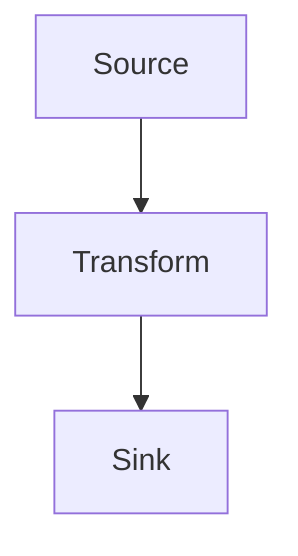

# Create Structured Linear Issue

This skill creates Linear issues formatted for the AgentForge Dev Orchestrator's
planner agent. The structured format minimizes open questions and maximizes the
planner's confidence score.

## Quick Reference

The orchestrator consumes these fields from every issue:

| Field | Used by | Notes |
|-------|---------|-------|
| `title` | Planner, PlanReviewer, PlanReviser, Reviewer | Concise imperative summary |
| `description` | Planner, PlanReviewer, PlanReviser, Reviewer | Structured markdown (see template below) |
| `labels` | Planner, PlanReviewer | Type + scope tags |
| `priority` | Planner, PlanReviewer | Linear 0-4 scale |
| `project` | RepoRegistry | Maps issue to target repository |

## Workflow

1. Gather the user's intent (what they want built/fixed/changed)
2. Ask clarifying questions if requirements are ambiguous
3. Look up the target team and project using `list_teams` and `list_projects`
   on the `plugin-linear-linear` MCP server
4. Compose the title, description, priority, and labels following the format below
5. Validate any label names against `list_issue_labels`, then call `save_issue`
   via the `plugin-linear-linear` MCP server
6. Return the created issue ID and URL to the user

## Title Convention

Format: `<type>(<scope>): <imperative summary>`

| Type | When to use |
|------|-------------|
| `feat` | New functionality |
| `fix` | Bug fix |
| `refactor` | Restructuring without behavior change |
| `chore` | Build, CI, deps, config |
| `docs` | Documentation only |
| `test` | Adding or fixing tests |
| `perf` | Performance improvement |

Rules:
- Imperative mood ("add", not "added" or "adds")
- Scope is the module or area affected (e.g. `auth`, `api`, `ui`, `db`)
- Under 80 characters total
- No trailing period

Examples:
- `feat(auth): add JWT refresh token rotation`
- `fix(api): prevent duplicate webhook processing`
- `refactor(db): extract query builder from repository classes`

## Description Template

Use this structure for the `description` field. Required sections: Context,
Requirements, Acceptance Criteria, Scope. Optional sections (TLDR, Metadata,
Architecture, Sequencing, Risks, Technical Hints) should be included whenever
the source material provides them -- especially when converting a Bruno-method
plan, which carries a TLDR, tier metadata, diagrams, sequencing, and risks that
must not be dropped. Use markdown. Preserve any repo-relative markdown links
from the source verbatim (see Section Guidance).

````
## TLDR

[Optional: 1-3 lines summarizing the whole issue at a glance.]

## Metadata

- **bruno-tier**: [lite | full -- omit if not from a Bruno plan]
- **Source plan**: [repo-relative link to the plan, e.g. [docs/plans/foo.md](docs/plans/foo.md)]
- **Related issues**: [PRY-1061, PRY-1062 -- omit if none]

## Context

[1-3 sentences: why this work is needed. Link to prior decisions or context.]

## Architecture

[Optional: architecture / data-flow notes carried from the plan. May include
fenced mermaid diagrams.]



## Requirements

[Flat shape -- use when the source is a simple request with no discrete tasks:]

1. [Concrete, testable acceptance criterion]
2. [Another criterion]
3. [...]

[Per-task shape -- use when the source is a plan with discrete tasks. Render one
block per task and preserve each task's sub-fields:]

### T1: [Task title]

- **Files:** [repo-relative links, e.g. [src/api/routes.ts](src/api/routes.ts)]
- **Falsifier:** [an independent check, DISTINCT from Acceptance, that would
  prove the task wrong if it fails]
- **Acceptance:** [what proves this specific task done]

### T2: [Task title]

- **Files:** [...]
- **Falsifier:** [...]
- **Acceptance:** [...]

## Sequencing

[Optional: phase / sub-phase ordering and dependencies between tasks.]

## Risks

[Optional: known risks, hazards, or things that could go wrong.]

## Technical Hints

- [Optional: relevant files, APIs, patterns, or prior art]
- [Optional: known constraints or gotchas]

## Acceptance Criteria

- [ ] [Checklist item that defines "done" for this issue]
- [ ] [Another checklist item]
- [ ] [Tests pass, lint clean, etc.]

## Scope

- **In scope**: [What this issue covers]
- **Out of scope**: [What this issue explicitly does NOT cover]
````

When using the per-task Requirements shape, the global Acceptance Criteria
section captures cross-cutting "done" checks (CI green, lint clean, docs
updated); per-task Acceptance/Falsifier stay inside their task blocks so the
task -> files -> check mapping survives.

### Section Guidance

**TLDR** (optional): 1-3 lines giving the at-a-glance summary. If the source is
a Bruno plan with a TLDR, carry it here as its own distinct element -- do NOT
fold it into Context, where it loses its at-a-glance role.

**Metadata** (optional): A structured slot for plan provenance instead of a
stray prose line. Include `bruno-tier` (lite/full) when the source is a
Bruno-method plan, a repo-relative link to the source plan path, and any
related issue identifiers. If the plan has frontmatter with a `todos` list, map
each todo into Requirements (one per task when the plan has discrete tasks). For
large plans, each task MAY instead become its own Linear sub-issue via
`parentId` (see "Creating the Issue via MCP").

**Context**: Give the planner enough background to form correct assumptions
without re-reading the entire codebase. Reference specific prior decisions or
issues if relevant.

**Architecture** (optional): Carries architecture / data-flow content from a
plan, including fenced ```mermaid``` diagram blocks. Use this whenever the
source has a diagram so it is not lost. Omit when there is no architecture to
convey.

**Requirements**: Testable criteria the planner uses to break work into steps.
Two shapes:
- *Flat*: a numbered list, for simple requests with no discrete tasks.
- *Per-task*: when the source is a plan with discrete `### Tn` task blocks,
  render one block per task and preserve each task's `**Files:**`,
  `**Falsifier:**`, and `**Acceptance:**` sub-fields. Do NOT flatten tasks into
  one numbered list plus a single global Acceptance checklist -- that loses the
  task -> files -> check mapping. A `**Falsifier:**` is a Bruno concept: an
  independent check DISTINCT from the acceptance criterion (it proves the task
  wrong if it fails), so it must survive as its own field rather than being
  merged into Acceptance.

**Sequencing** (optional): Phase / sub-phase ordering and inter-task
dependencies. Keep this as a first-class section rather than overloading it into
Technical Hints.

**Risks** (optional): Known risks, hazards, or things that could go wrong. Keep
this first-class rather than folding it into Technical Hints.

**Technical Hints**: Point to specific files, functions, or patterns. This
directly reduces the planner's open questions. Omit if the task is
self-explanatory.

**Acceptance Criteria**: Checklist items that the reviewer agent checks the
implementation against. Be specific -- "works correctly" is not useful;
"returns 401 for expired tokens" is. When using the per-task Requirements shape,
this section holds cross-cutting "done" checks; per-task acceptance lives in the
task blocks.

**Scope**: Explicit boundaries prevent the planner from over-scoping or
under-scoping the plan. Always state what is out of scope.

**Preserving links**: When the source material uses repo-relative markdown links
like `[path/to/file.ts](path/to/file.ts)`, keep them as markdown links in every
section (Metadata, Architecture, Requirements `**Files:**`, Technical Hints,
etc.). Do NOT degrade them to bare paths or plain code spans -- clickability is
part of the value.

## Mode: Full Plan Pass-Through

Use this mode when the user supplies an ALREADY-FINALIZED, detailed plan -- for
example a plan file or blob shaped through iterations with Claude Code or Cursor
-- and wants it wrapped into a Linear issue for an AgentForge run. In this mode
the plan IS the spec: the user has already made the decisions, so your job is
faithful translation into the issue, NOT re-planning, condensing, or "improving".

**Core rule -- lossless pass-through.** Do NOT summarize, compress, paraphrase,
re-order, or drop ANY part of the supplied plan. Preserve verbatim:
- Every decision and the rationale behind it
- Every explicit guideline, constraint, and "do" / "do NOT" instruction
- Every task, sub-step, and its ordering / dependencies
- All file paths, code snippets, commands, config, and links (keep markdown links)
- Diagrams (mermaid or otherwise), tables, and any inline examples

**How to wrap it:**

1. Map the plan onto the description template sections where it fits cleanly:
   TLDR, Architecture (diagrams), per-task Requirements (`### Tn` with
   `**Files:**` / `**Falsifier:**` / `**Acceptance:**`), Sequencing, Risks,
   Technical Hints, Scope. This makes the issue navigable.
2. ALSO embed the full original plan verbatim inside the authoritative-plan fence
   (below) so nothing is lost even if the section mapping is imperfect. When in
   doubt about where a detail belongs, it still survives inside the fence.
3. In Metadata, record provenance: a `**Source plan**` link (if it came from a
   file) and a note that this issue is a verbatim plan pass-through.
4. Do NOT invent acceptance criteria, scope boundaries, or requirements the plan
   did not state. If the plan omits a template section, omit that section rather
   than fabricating content. The only thing you add is light structural
   scaffolding (headings) -- never new decisions.

**Authoritative-plan fence.** Wrap the verbatim plan in these exact sentinel
lines inside the `description` so the AgentForge planner recognizes it as a
pre-approved spec to implement faithfully (the planner prompt honors this fence):

`````
## Authoritative Plan

===== BEGIN AUTHORITATIVE PLAN (PRE-APPROVED — IMPLEMENT FAITHFULLY, DO NOT OMIT) =====

[the full supplied plan, verbatim -- every section, decision, guideline, snippet,
diagram, and link preserved]

===== END AUTHORITATIVE PLAN =====
`````

Place this fence after the mapped template sections (after Technical Hints,
before Acceptance Criteria). Keep the fence even when you have also mapped the
plan into structured sections -- the structured sections aid navigation; the
fence guarantees nothing is dropped. Do not alter the sentinel text (the planner
matches it exactly).

For very large plans you MAY split each top-level task into its own sub-issue via
`parentId` (see "Creating the Issue via MCP"); when you do, each sub-issue still
carries its slice of the plan verbatim under its own authoritative-plan fence,
and the parent carries the overall plan and sequencing.

## Priority Mapping

| Linear Value | Meaning | Use when |
|--------------|---------|----------|
| 0 | No priority | Not yet triaged |
| 1 | Urgent | Blocking production or other work |
| 2 | High | Needed this cycle |
| 3 | Medium | Important but not time-sensitive |
| 4 | Low | Nice-to-have, backlog |

## Labels

Apply labels that help the planner understand the nature of the work:

- **Type labels**: `feature`, `bug`, `refactor`, `chore`, `docs`, `test`
- **Scope labels**: Match the `(<scope>)` from the title -- e.g. `auth`, `api`, `ui`
- **AI labels**: The orchestrator manages `ai:*` labels automatically; do NOT set them manually

## Creating the Issue via MCP

This workspace has multiple Linear MCP servers. Use **`plugin-linear-linear`** --
it is the reliably authenticated one. Its creation tool is **`save_issue`**
(NOT `linear_create_issue`): `save_issue` creates a new issue when no `id` is
passed, and updates an existing issue when `id` is given.

Required on create: `title` and `team`. The `team` field accepts a NAME or ID
(e.g. `"Prysmic"`), so you do not strictly need to resolve the team ID first.

```json
{
  "title": "feat(auth): add JWT refresh token rotation",
  "description": "## Context\n\nRefresh tokens currently never expire...\n\n## Requirements\n\n1. ...",
  "team": "Prysmic",
  "project": "Twin",
  "priority": 2,
  "labels": ["feature", "auth"]
}
```

> **Note on `description`**: it is Markdown. Use literal newlines in the value --
> do NOT escape them. (The JSON above shows `\n` only because JSON string
> literals require it; when calling the tool, pass real newlines.)

Fields accepted by `save_issue`:
- `title` -- required on create; formatted per the title convention above
- `team` -- required on create; team NAME or ID (e.g. `"Prysmic"`)
- `description` -- Markdown body (literal newlines, not escaped)
- `project` -- project name, ID, or slug; the orchestrator uses the project name
  to resolve the target repository, so set it when a matching project exists
- `priority` -- 0-4; defaults to 0 (no priority) if omitted
- `labels` -- array of label NAMES or IDs (validate names first, see below)
- `assignee` -- assignee name or ID
- `parentId` -- make this issue a sub-issue of another; for large plans, each
  task MAY become its own sub-issue under a parent
- `relatedTo` / `blocks` / `blockedBy` -- arrays of issue identifiers like
  `["PRY-1061"]`
- `links` -- array of `{ "url": "...", "title": "..." }`

### Discovering team and project

If the user hasn't specified these, look them up on `plugin-linear-linear`:

1. Call `list_teams` to list available teams
2. Call `list_projects` (it supports a `query` string) to find the project
3. Call `list_issue_labels` and confirm every label name you plan to apply
   exists -- applying a non-existent label name may cause the call to fail. If a
   needed label is missing, create it with `create_issue_label` (or drop it)
4. Pass the team/project names (or IDs) into `save_issue`

**If no project matches**: create the issue WITHOUT a `project` (it will live
under the team) and tell the user that no matching project was found. A project
is not mandatory -- do not block on it.

### Alternative server (`user-Linear`)

There is also a `user-Linear` server. It exposes the SAME tool surface as
`plugin-linear-linear` (`save_issue`, `list_teams`, `list_projects`,
`list_issue_labels`, etc.), so the workflow above is identical if you fall back
to it. Prefer `plugin-linear-linear` as the primary; use `user-Linear` only if
the primary is unavailable.

## Inline Example

**User says**: "We need to add rate limiting to the API"

**Structured issue**:

- **Title**: `feat(api): add request rate limiting`
- **Priority**: 2 (High)
- **Labels**: `feature`, `api`
- **Description**:

```markdown
## Context

The API currently has no rate limiting. Any client can make unlimited requests,
which risks resource exhaustion and abuse. This was flagged during the security
review.

## Requirements

1. Add per-client rate limiting using a token bucket algorithm
2. Rate limit applies to all authenticated API endpoints
3. Return 429 Too Many Requests with Retry-After header when limit exceeded
4. Rate limit configuration (requests/window) is read from environment variables
5. Rate limit state is stored in-memory (Redis upgrade is a separate issue)

## Technical Hints

- Fastify route plugin in `foundry/src/api/routes.ts`
- Existing auth hook extracts client identity from the request
- Consider `@fastify/rate-limit` plugin

## Acceptance Criteria

- [ ] Rate limiting middleware is applied to all `/api/*` routes
- [ ] Exceeding the limit returns 429 with correct Retry-After header
- [ ] Limits are configurable via `RATE_LIMIT_MAX` and `RATE_LIMIT_WINDOW_MS` env vars
- [ ] Existing tests still pass
- [ ] New tests cover rate limit enforcement and header correctness

## Scope

- **In scope**: Per-client in-memory rate limiting for API routes
- **Out of scope**: Redis-backed distributed rate limiting, WebSocket rate limiting
```

For more examples (bug fix, refactor, chore), see [create-linear-issue-examples.md](.agents/skills/create-linear-issue-examples.md).
