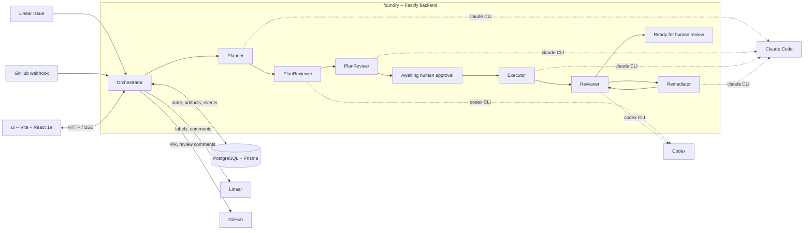

# AgentForge

> Independent agentic dev framework that consumes tickets and ships code as pull requests.

[](LICENSE)
[](https://nodejs.org)
[](https://www.typescriptlang.org/)
[](https://fastify.dev/)
[](https://react.dev/)
[](https://github.com/hidday/AgentForge/actions/workflows/ci.yml)

AgentForge picks up Linear issues, drives them through a deterministic state machine, and uses **local CLI-based AI agents** -- Claude Code, Codex, and Cursor -- as subprocess runtimes to plan, review, implement, review again, and remediate, until a pull request is ready for human review on GitHub.

There are no hosted Anthropic / OpenAI API calls, no agent-framework SDKs, and no cloud control plane. The orchestrator runs on your machine, spawns the same CLIs you already use interactively, and treats their structured stdout as the agent's output.

---

## Table of contents

- [Why CLI-based agents](#why-cli-based-agents)
- [Architecture](#architecture)
- [Repository layout](#repository-layout)
- [Quickstart](#quickstart)
- [Screenshots](#screenshots)
- [Operational model](#operational-model)
- [Documentation](#documentation)
- [Contributing](#contributing)
- [Security](#security)
- [License](#license)

---

## Why CLI-based agents

This project intentionally treats AI agents as **external CLI runtimes** rather than hosted API clients:

- **Claude Code CLI** (`claude`) handles planning, plan revision, implementation, and remediation.
- **Codex CLI** (`codex`) handles plan review and code review (a second-opinion model family).
- **Cursor CLI** (`agent`) is a third optional runtime, addressable per stage via env config.
- **No direct Anthropic / OpenAI API calls** anywhere in the codebase.
- **No agent SDK** (LangChain, AutoGen, CrewAI, etc.) listed as a dependency.

The orchestrator spawns each agent as a child process, passes prompts via stdin, captures stdout/stderr, parses JSON wrapped in `BEGIN_STRUCTURED_OUTPUT` / `END_STRUCTURED_OUTPUT` sentinels, and advances a deterministic state machine. You keep your existing CLI tooling, billing, and authentication; AgentForge just orchestrates them.

## Architecture



The Linear ticket is the input, a GitHub PR marked "Ready for review" is the output, and the Postgres database is the source of truth for state, artifacts, and events. The React UI is a live dashboard over the same data.

## Repository layout

| Path | What lives here |
|---|---|
| [`foundry/`](foundry/) | Fastify 5 backend: orchestrator, agents, runtime, Prisma schema, webhooks, sync. See [`foundry/README.md`](foundry/README.md). |
| [`ui/`](ui/) | Vite + React 19 dashboard for monitoring runs, reviewing artifacts, and chatting with agents. See [`ui/README.md`](ui/README.md). |
| [`scripts/`](scripts/) | Repo-level dev tooling. `dev.mjs` boots backend + UI together; `run-or-rerun.mjs` is the restart helper. |
| [`.cursor/`](.cursor/), [`.agents/`](.agents/), [`.claude/`](.claude/) | Skills and slash-commands for the IDE assistants that drive AgentForge from the inside. |
| [`.prompts/`](.prompts/) | Prompts for the recurring research-and-issue-creation pipeline. |

## Quickstart

Prerequisites:

- **Node.js >= 22.12** (the repo ships a `.nvmrc`; run `nvm use`). On Apple Silicon, make sure your Node binary is `arm64`, not Rosetta -- the dev script will refuse to start otherwise.
- **Docker** (for Postgres).
- **pnpm** (used for `foundry/`) and **npm** (used for `ui/`).
- *(optional, real mode only)* `claude`, `codex`, and `agent` (Cursor) CLIs installed and authenticated locally.

```bash
git clone https://github.com/hidday/AgentForge.git
cd AgentForge

nvm use            # picks up Node 22 from .nvmrc
pnpm setup         # installs foundry/ + ui/

# Postgres in a named volume that survives `docker volume prune` mishaps.
docker volume create agentforge_pg_data
docker run -d --name agentforge-postgres --restart unless-stopped \
  -e POSTGRES_USER=postgres \
  -e POSTGRES_PASSWORD=postgres \
  -e POSTGRES_DB=ai_orchestrator \
  -p 5433:5432 \
  -v agentforge_pg_data:/var/lib/postgresql/data \
  postgres:16

cp foundry/.env.example foundry/.env
cp foundry/repos.config.example.json foundry/repos.config.json   # optional; loader falls back to the example

cd foundry && pnpm db:push && pnpm db:generate && cd ..

npm run dev        # boots Fastify on :3100 and Vite on :5173 with shared logging
```

Open <http://localhost:5173> for the dashboard. The default `AGENT_RUNTIME_MODE=mock` ships canned outputs for all six agent stages, so you can drive a full Linear-issue -> PR loop without installing any AI CLI. Flip to `AGENT_RUNTIME_MODE=real` once you have `claude` and `codex` working.

## Screenshots

> _Screenshots and a short demo GIF will live here. Until they're recorded, run the quickstart above and visit `/runs` for the dashboard or open any run for the artifact viewer + run-scoped chat._

## Operational model

- **Two-tier review**: an AI plan reviewer runs before human approval; an AI code reviewer runs after implementation, with a remediation loop.
- **"The boss" pattern**: the planner / remediator act as the lead engineer when revising. Reviewer findings get explicit accept / dismiss / partial dispositions with rationales; nothing is blindly applied.
- **Explicit human gate**: every run pauses at `AwaitingPlanApproval` until a human approves a specific plan version (`approvedPlanVersion` is recorded on the run).
- **Linear + GitHub sync**: every state transition pushes a label change to Linear and updates the PR / review comments on GitHub. The DB stays the source of truth.
- **Multi-repo**: one orchestrator can drive issues across multiple repositories via [`foundry/repos.config.json`](foundry/repos.config.example.json), routed by Linear project or team.
- **Mock-first**: the default mode runs the full workflow with canned CLI outputs. Useful for development, demos, and writing tests against a stable workflow shape.

The detailed state machine, artifact model, policy gates, and CLI invocation contract are documented in [`foundry/README.md`](foundry/README.md).

## Documentation

- [`foundry/README.md`](foundry/README.md) -- backend architecture, state machine, artifacts, env vars, mock vs. real mode, multi-repo config.
- [`ui/README.md`](ui/README.md) -- UI features, dev server, API contract.
- [`CONTRIBUTING.md`](CONTRIBUTING.md) -- how to set up, test, lint, and submit changes.
- [`SECURITY.md`](SECURITY.md) -- how to report vulnerabilities and the threat model.
- [`CODE_OF_CONDUCT.md`](CODE_OF_CONDUCT.md) -- contributor expectations.

## Contributing

Issues and pull requests are welcome. Please read [`CONTRIBUTING.md`](CONTRIBUTING.md) before opening a PR -- it covers the branching model, conventional-commit style, and the lint / typecheck / test bar that CI enforces.

## Security

If you discover a security issue, please follow the instructions in [`SECURITY.md`](SECURITY.md). Don't open a public issue.

## License

[MIT](LICENSE) -- see the file for the full text.
